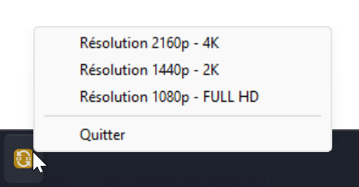

# NEURO-SWITCHRES

Ce programme est conçu pour changer la résolution de tous les écrans connectés. (1080p, 2k, 4k)

Il est écrit en Rust et utilise l'API Windows pour interagir avec les paramètres d'affichage du système.

Détecte automatiquement tous les écrans connectés.

Testé sous Windows 11 x64

NVIDIA RTX 2xxx

3 écrans 4k Philips :

- 2 DISPLAYS PORT
- 1 HDMI


## Installation Rust

Rust Version 1.71.0
https://www.rust-lang.org/tools/install


# Compatibilité

Windows 10 - 11


## Build for Development and Run

```powershell
  cd neuroswitchres
  C:\Users\%username%\.cargo\bin\cargo.exe build
  C:\Users\%username%\.cargo\bin\cargo.exe run
```


## Build for Production and Run


```powershell
# Construire l'application
C:\Users\%username%\.cargo\bin\cargo.exe build --release


# Copiez le répertoire resources dans le répertoire target/release/
New-Item -Path "target/release/resources" -ItemType Directory -Force -ErrorAction SilentlyContinue > $null; Copy-Item -Path "resources/*" -Destination "target/release/resources" -Recurse

# Lancer l'application
./target/release/neuroswitchres.exe
```





Choisir la résolution souhaitée.


## License

[GNU GPLv3](https://choosealicense.com/licenses/gpl-3.0/)


[](https://opensource.org/licenses/)


## Authors

- [@Abneco](https://github.com/Abneco/)

